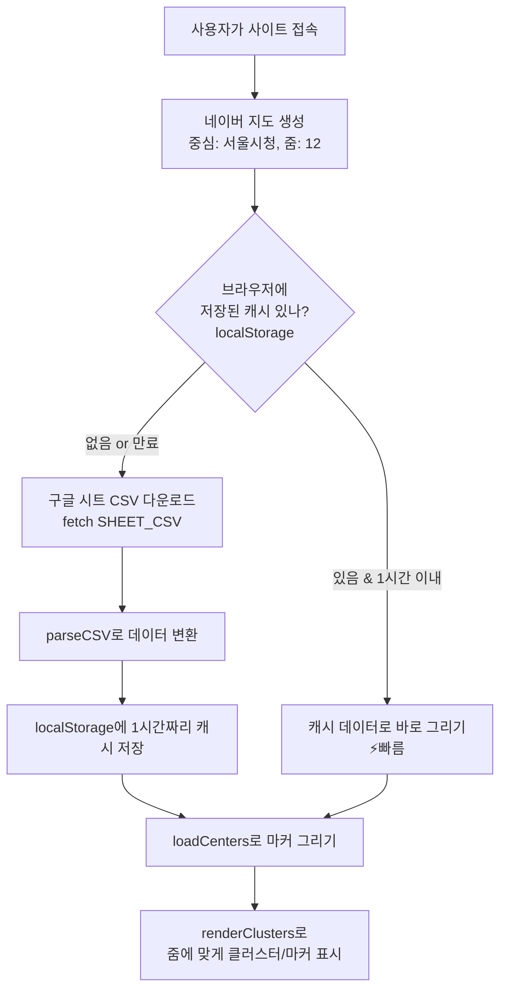
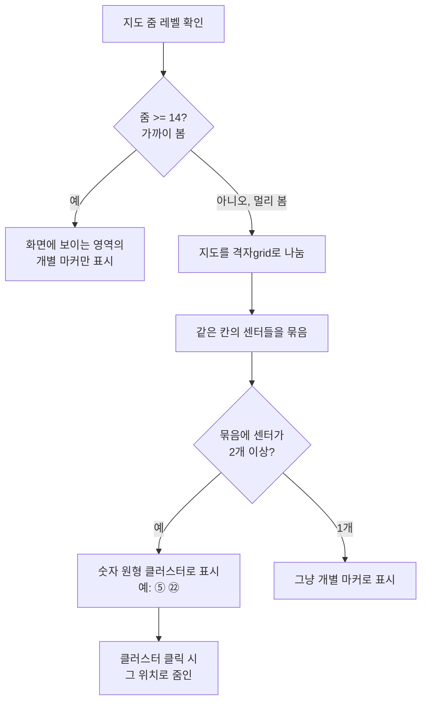
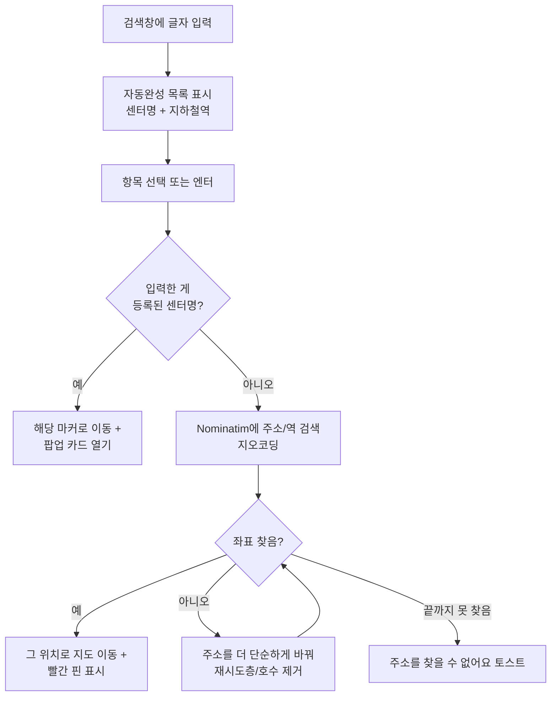
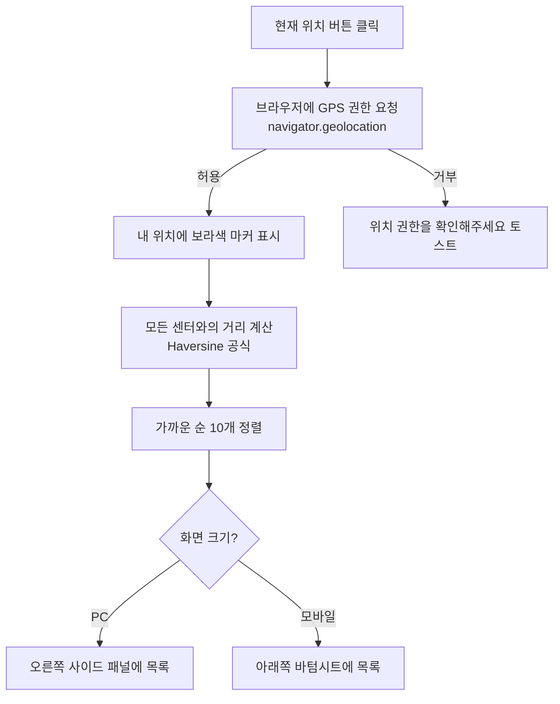
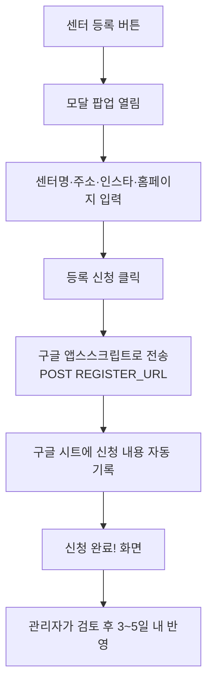

# 🗺️ 모티맵 (Moti Map)

> **내 근처 모티피지오 센터를 지도에서 찾아주는 웹 서비스**
> 실서비스 주소: **https://map.motiphysio.com**

전국의 모티피지오(체형교정·필라테스·재활·다이어트/PT 등) 센터를 네이버 지도 위에 표시하고,
사용자가 검색·필터·현재 위치로 가까운 센터를 쉽게 찾을 수 있게 해주는 서비스입니다.

---

## 📌 이 문서를 읽는 분께 (먼저 읽어주세요!)

이 문서는 **이제 막 입사한 신입 개발자**가 처음부터 끝까지 따라 할 수 있도록 쓰여졌습니다.
"이런 건 당연히 알겠지" 하고 넘어가지 않고, 최대한 친절하게 하나씩 설명합니다.

처음 보는 용어가 나오면 당황하지 마세요. 문서 맨 아래 **[📖 용어집](#-용어집-처음-보는-단어-정리)** 에 쉬운 말로 정리해 두었습니다.

읽는 순서를 추천드리면:

1. **[프로젝트가 어떤 구조인지](#-한눈에-보는-구조)** 큰 그림 먼저 보기
2. **[꼭 알아야 할 핵심 개념](#-시작하기-전에-알아야-할-핵심-개념-3가지)** 3가지 이해하기
3. **[설치 가이드](#-개발-환경-설치-가이드-처음부터-끝까지)** 따라서 내 컴퓨터에서 실행해보기
4. 실행이 되면 → **[동작 흐름](#-전체-동작-흐름)** 과 **[코드 수정 가이드](#-자주-하는-작업-코드-수정-가이드)** 보기

---

## 🎯 한눈에 보는 구조

이 프로젝트의 가장 큰 특징은 **"서버가 거의 없다"** 는 것입니다.
보통 웹 서비스는 백엔드 서버 + 데이터베이스가 필요하지만, 모티맵은 **HTML 파일 하나**로 거의 모든 기능이 동작합니다.

```
                         ┌─────────────────────────────┐
                         │      사용자 브라우저          │
                         │   (index.html 하나가 실행)    │
                         └──────────────┬──────────────┘
                                        │
         ┌──────────────┬───────────────┼───────────────┬──────────────┐
         │              │               │               │              │
         ▼              ▼               ▼               ▼              ▼
   ┌──────────┐  ┌────────────┐  ┌────────────┐  ┌───────────┐  ┌──────────┐
   │ 네이버    │  │ 구글 시트   │  │ Nominatim  │  │  구글      │  │ 구글 애널 │
   │ 지도 API  │  │ (CSV)      │  │ (주소→좌표) │  │ 앱스스크립트│  │ 리틱스 등 │
   │           │  │            │  │            │  │           │  │          │
   │ 지도 그리기│  │ 센터 데이터 │  │ 검색 시 사용│  │ 센터 등록  │  │ 방문 분석 │
   │           │  │ = "DB역할"  │  │            │  │ 접수      │  │          │
   └──────────┘  └────────────┘  └────────────┘  └───────────┘  └──────────┘
       외부          외부            외부            외부           외부
     서비스          서비스          서비스          서비스         서비스
```

즉, **우리가 직접 만든 코드는 `index.html` 한 개**이고,
나머지 기능(지도, 데이터 저장, 주소 검색, 등록 접수, 통계)은 **모두 외부 무료 서비스를 가져다 씁니다.**

> 💡 **왜 이렇게 만들었을까요?**
> 서버를 직접 운영하면 비용·관리·보안 부담이 큽니다.
> 모티맵은 데이터가 자주 바뀌지 않는 "센터 목록 지도" 서비스라서,
> 무거운 서버 없이 **정적 파일 + 외부 서비스 조합**으로 충분히 빠르고 저렴하게 만들 수 있습니다.

---

## 🧠 시작하기 전에 알아야 할 핵심 개념 3가지

신입 개발자가 이 프로젝트를 이해하려면 아래 3가지 개념만 알면 됩니다.

### 1️⃣ "정적 웹사이트(Static Website)" 란?

- **빌드(build) 과정이 없습니다.** React나 Vue처럼 `npm run build` 같은 걸 하지 않습니다.
- `index.html` 파일을 브라우저가 그냥 열기만 하면 끝입니다.
- HTML 안에 CSS와 JavaScript가 **전부 들어있습니다.** (파일을 나누지 않은 "단일 파일" 구조)
- 그래서 배포도 단순합니다 — 파일을 웹 서버에 올려두기만 하면 됩니다.

### 2️⃣ "구글 시트가 데이터베이스 역할" 을 합니다

보통은 MySQL 같은 데이터베이스에 센터 정보를 저장하지만, 모티맵은 **구글 스프레드시트**를 DB처럼 씁니다.

```
구글 시트 (관리자가 엑셀처럼 센터 정보 입력)
        │
        │  "웹에 게시" 기능으로 CSV 주소를 만듦
        ▼
https://docs.google.com/.../pub?output=csv   ← 이 주소로 데이터를 받아옴
        │
        ▼
index.html 이 이 CSV를 fetch()로 읽어서 → 지도에 마커로 표시
```

- 센터를 추가/수정하려면 **코드를 고치는 게 아니라 구글 시트를 수정**하면 됩니다.
- 시트 한 줄(row) = 센터 한 개. 열(column)은 `name, lat, lng, category, phone, address, instagram, website, placeurl` 등입니다.
- 코드에서 이 CSV 주소는 [index.html](index.html#L943) 의 `SHEET_CSV` 상수에 들어있습니다.

### 3️⃣ "지오코딩(Geocoding)" = 주소를 위도/경도로 바꾸기

지도에 점을 찍으려면 **위도(latitude)·경도(longitude)** 숫자가 필요합니다.
하지만 사람은 "강남역", "서울시 마포구 …" 같은 글자로 검색하죠.

이 글자를 좌표로 바꿔주는 것이 **지오코딩**이고, 모티맵은 무료 서비스인 **Nominatim(OpenStreetMap)** 을 씁니다.
검색창에 주소나 역 이름을 넣으면 이 서비스가 좌표를 알려주고, 지도가 그 위치로 이동합니다.

---

## 📂 프로젝트 구조

현재 체크아웃된 `main` 브랜치의 파일들입니다.

```
66.Moti-Map/
├── index.html        ★ 핵심 파일. 앱의 전부(HTML+CSS+JS)가 여기 들어있음 (약 1,700줄)
├── assets/
│   ├── favicon.png   브라우저 탭 아이콘 + 본사("엠지솔루션스 모티피지오") 특별 마커 이미지
│   └── og-image.png  카카오톡/페북 공유 시 보이는 미리보기 이미지 (Open Graph)
├── robots.txt        검색엔진 크롤러에게 "전체 페이지 수집 허용" 안내
├── sitemap.xml       검색엔진에게 사이트 구조를 알려주는 SEO 파일
├── .gitignore        Git이 추적하지 않을 파일 목록 (비밀키·개인정보 등)
└── README.md         지금 보고 있는 이 문서
```

**핵심은 단 하나, [index.html](index.html) 입니다.** 나머지는 이미지와 SEO·설정 파일입니다.

### `index.html` 내부 구성

한 파일이지만 크게 3덩어리로 나뉩니다.

| 영역 | 위치(대략) | 내용 |
|------|-----------|------|
| `<head>` 메타·SEO | [1~64줄](index.html#L1-L64) | 제목, 구글 애널리틱스, SEO 메타태그, OG 태그, 구조화 데이터(JSON-LD) |
| `<style>` CSS | [68~806줄](index.html#L68-L806) | 모든 화면 스타일. 헤더·검색바·필터·마커 팝업·패널·모달·반응형(모바일/태블릿/PC) |
| `<body>` HTML | [808~939줄](index.html#L808-L939) | 화면 구조: 헤더, 등록 모달, 카테고리 필터, 지도, 패널, 버튼들 |
| `<script>` JS | [942~1686줄](index.html#L942-L1686) | 핵심 로직. 지도 생성·데이터 로딩·마커·클러스터·검색·필터·위치·등록 |

`<script>` 안의 주요 함수들:

| 함수/변수 | 위치 | 역할 |
|----------|------|------|
| `SHEET_CSV` | [943](index.html#L943) | 센터 데이터(구글 시트 CSV) 주소 |
| `parseCSV()` | [999](index.html#L999) | 받아온 CSV 텍스트를 자바스크립트 객체 배열로 변환 |
| `addMarker()` | [1017](index.html#L1017) | 센터 1개를 지도에 마커로 추가 + 클릭 시 팝업 카드 생성 |
| `renderClusters()` | [1137](index.html#L1137) | 줌 레벨에 따라 마커를 묶어서 보여주는 클러스터링 |
| `loadCenters()` | [1210](index.html#L1210) | 전체 센터 데이터를 마커로 그리기 |
| `STATIONS` / `STATION_LINES` | [1262](index.html#L1262) | 지하철역 약 300개 목록 + 노선/색상 (검색 자동완성용) |
| `showAutocomplete()` | [1303](index.html#L1303) | 검색창 입력 시 자동완성 목록 표시 |
| `doSearch()` | [1403](index.html#L1403) | 실제 검색 실행 (센터명 우선 → 없으면 주소 지오코딩) |
| `applyFilter()` | [1452](index.html#L1452) | 카테고리 필터 적용 |
| `calcDistance()` | [1470](index.html#L1470) | 두 좌표 사이 거리 계산 (Haversine 공식) |
| `showNearbyPanel()` | [1545](index.html#L1545) | 가까운 센터 목록 패널 표시 |
| `locateMe()` | [1598](index.html#L1598) | 현재 위치 받아오기(GPS) |
| `submitRegister()` | [1656](index.html#L1656) | 센터 등록 신청 전송 |

---

## 🔄 전체 동작 흐름

### 흐름 1. 페이지가 처음 열릴 때 (데이터 로딩 + 캐싱)

사용자가 사이트에 접속하면 이런 순서로 동작합니다.



> 💡 **캐싱(caching)을 왜 할까요?**
> 매번 구글 시트에서 데이터를 받으면 느립니다. 그래서 한 번 받은 데이터를 브라우저에
> `localStorage`(브라우저 내장 저장소)에 **1시간 동안 저장**해 둡니다. 1시간 안에 재방문하면
> 다운로드 없이 즉시 화면을 그립니다. 관련 코드: [index.html:1207-1236](index.html#L1207-L1236)

### 흐름 2. 마커 표시와 클러스터링 (지도가 안 복잡하게)

센터가 수백 개면 점이 너무 많아 지저분합니다. 그래서 **멀리서 볼 땐 묶어서(클러스터) 보여줍니다.**



관련 코드: [renderClusters() index.html:1137](index.html#L1137), 줌별 격자 크기는 `getGridSize()` [index.html:1129](index.html#L1129)

### 흐름 3. 검색 (자동완성 → 검색)



> 💡 **재시도 로직이 똑똑합니다.** "서울 마포구 동교로23길 10, 1층 5층 모티피지오" 처럼 상세주소가 길면
> 지오코딩이 실패할 수 있어, 층·호수 정보를 단계적으로 제거하며 다시 검색합니다. 코드: [index.html:1418](index.html#L1418)

### 흐름 4. 현재 위치로 가까운 센터 찾기



### 흐름 5. 센터 등록 신청

지도에 없는 센터를 사용자가 직접 등록 신청할 수 있습니다.



관련 코드: `submitRegister()` [index.html:1656](index.html#L1656), 전송 주소 `REGISTER_URL` [index.html:1635](index.html#L1635)

---

## ✨ 주요 기능 요약

| 기능 | 설명 |
|------|------|
| 🗺️ 지도 표시 | 네이버 지도에 전국 센터를 마커로 표시 |
| 🎨 카테고리 필터 | 8종(전체/체형교정/필라테스/다이어트·PT/병·의원/뷰티/교육기관/스포츠시설), 색상 구분 |
| 🔍 검색 + 자동완성 | 센터명·지하철역·주소 검색, 입력 중 자동완성 (지하철 노선 색 아이콘 포함) |
| 📍 현재 위치 | GPS로 내 위치 잡고 가까운 센터 10곳 목록 표시 |
| 🔵 클러스터링 | 멀리서 보면 마커를 숫자로 묶어 표시 |
| ➕ 센터 등록 | 사용자가 직접 신규 센터 등록 신청 |
| 📱 반응형 | PC=사이드 패널 / 모바일=바텀시트, 태블릿·소형폰까지 대응 |
| 📊 분석 | 구글 애널리틱스 + MS Clarity로 클릭·검색 등 행동 추적 |

---

## 🚀 개발 환경 설치 가이드 (처음부터 끝까지)

> 정적 사이트라서 설치가 아주 간단합니다. 하지만 **그냥 `index.html`을 더블클릭으로 열면 안 됩니다.**
> (이유는 아래 ⚠️ 참고) 반드시 **로컬 웹 서버**로 띄워야 합니다.

### STEP 0. 필요한 프로그램 (이미 있으면 건너뛰기)

| 프로그램 | 용도 | 확인 명령어 |
|---------|------|-----------|
| **Git** | 소스 코드 받기/관리 | `git --version` |
| **VS Code** | 코드 편집기 (권장) | — |
| **Node.js** 또는 **Python** | 로컬 서버 실행용 (둘 중 하나만 있으면 됨) | `node -v` / `python --version` |

설치 링크: [Git](https://git-scm.com/) · [VS Code](https://code.visualstudio.com/) · [Node.js](https://nodejs.org/) · [Python](https://www.python.org/)

### STEP 1. 소스 코드 받기 (클론)

터미널(PowerShell 또는 Git Bash)에서:

```bash
git clone https://github.com/jjin3633/MotiMap.git
cd MotiMap
```

> 이미 받으셨다면 이 단계는 건너뛰고, 폴더 안으로 이동만 하면 됩니다.

### STEP 2. 로컬 웹 서버로 실행하기 (3가지 방법 중 하나 선택)

#### 방법 A. VS Code "Live Server" 확장 (가장 쉬움 ⭐ 추천)

1. VS Code에서 프로젝트 폴더 열기
2. 왼쪽 확장(Extensions) 아이콘 → **"Live Server"** 검색 → 설치
3. `index.html` 파일을 연 상태에서, 우클릭 → **"Open with Live Server"**
4. 브라우저가 자동으로 `http://127.0.0.1:5500/index.html` 을 엽니다

#### 방법 B. Python (파이썬이 깔려 있다면)

```bash
# 프로젝트 폴더 안에서
python -m http.server 5500
```
→ 브라우저에서 `http://localhost:5500` 접속

#### 방법 C. Node.js

```bash
# 프로젝트 폴더 안에서 (설치 없이 1회 실행)
npx serve -l 5500
```
→ 안내되는 주소(`http://localhost:5500`)로 접속

### STEP 3. 화면 확인 ✅

브라우저에 **서울 중심의 지도와 센터 마커들**이 보이면 성공입니다! 🎉
- 검색창에 "강남역"을 쳐보세요 → 자동완성이 뜨고 이동합니다.
- 오른쪽 아래 ⊙(현재 위치) 버튼을 눌러보세요 → 위치 권한을 허용하면 가까운 센터가 뜹니다.

### ⚠️ 꼭 알아둘 주의사항

1. **`file://`로 열면 안 됩니다.**
   `index.html`을 탐색기에서 더블클릭하면 주소가 `file:///...`이 되는데, 이러면
   `fetch()`(데이터 다운로드)와 GPS 위치 기능이 브라우저 보안 정책 때문에 막힙니다.
   → **반드시 `http://localhost`** 형태(=로컬 서버)로 열어야 합니다.

2. **네이버 지도가 "인증 실패"로 안 뜰 수 있습니다.**
   코드에 박혀 있는 네이버 지도 키(`ncpKeyId=i3me2n4vzp`)는 **허용된 도메인에서만** 동작합니다.
   `localhost`가 허용 목록에 없으면 지도가 안 뜰 수 있어요. 이 경우:
   → **네이버 클라우드 플랫폼 콘솔 → Maps → 인증 → Web 서비스 URL** 에
     `http://localhost:5500` 을 추가해야 합니다. (접근 권한이 필요하니 선임에게 문의)

3. **GPS(현재 위치)는 `localhost` 또는 `https`에서만** 동작합니다. (브라우저 보안 규칙)
   로컬 서버(`localhost`)에서는 정상 동작합니다.

> 별도의 `.env`, API 키 파일, 패키지 설치(`npm install`)가 **필요 없습니다.** 외부 서비스 주소가 코드에 들어있어서, 위 STEP만 하면 바로 돌아갑니다.

---

## 🛠️ 자주 하는 작업 (코드 수정 가이드)

신입이 처음 맡을 만한 작업들을 예시로 정리했습니다.

### ① 센터를 추가/수정하고 싶어요

👉 **코드를 고치지 않습니다!** 데이터는 **구글 시트**에 있습니다.
- 관리자용 구글 시트에 한 줄 추가/수정하면 됩니다 (시트 접근 권한은 팀에 문의).
- 필요한 열: `name`(이름), `lat`/`lng`(위도·경도), `category`(카테고리), `address`(주소),
  `phone`, `instagram`, `website`, `placeurl`(상세보기 링크)
- 사이트에 반영은 캐시 때문에 **최대 1시간** 걸립니다. 즉시 보려면 브라우저 새로고침 후
  개발자도구 → Application → Local Storage에서 `motimap_centers_v1` 키를 삭제하세요.

### ② 카테고리를 추가하고 싶어요

코드 **두 곳**을 함께 고쳐야 합니다.

1. **필터 버튼 추가** — [index.html:879-888](index.html#L879-L888) `#filterBar` 안에 버튼 한 줄 추가:
   ```html
   <button class="filter-btn" data-cat="새카테고리" style="--cat-color:#원하는색;">새카테고리</button>
   ```
2. **색상 등록** — [index.html:954-962](index.html#L954-L962) `CATEGORY_COLORS` 객체에 추가:
   ```javascript
   '새카테고리': '#원하는색',
   ```
   (마커 색과 필터 버튼 색을 똑같이 맞춰주세요.)

### ③ 지도 첫 화면 위치/줌을 바꾸고 싶어요

[index.html:945-949](index.html#L945-L949) 에서:
```javascript
const map = new naver.maps.Map('map', {
  center: new naver.maps.LatLng(37.5665, 126.9780),  // ← 위도, 경도
  zoom: 12,                                            // ← 숫자 클수록 확대
  ...
```

### ④ 지하철역 자동완성에 역을 추가하고 싶어요

[index.html:1262](index.html#L1262) `STATIONS` 배열에 역 이름 추가, 노선 색이 필요하면
[index.html:1275](index.html#L1275) `STATION_LINES`에 `'역이름':[노선번호]` 형태로 추가합니다.

> 코드를 수정할 땐 **`develop` 브랜치에서 작업**하고, 검토 후 `main`에 합치는 것이 안전합니다. (아래 [브랜치 전략](#-브랜치-전략) 참고)

---

## 📦 배포 (Deploy)

> 배포 자동화 설정은 `develop` 브랜치의 [.github/workflows/deploy.yml](https://github.com/jjin3633/MotiMap/blob/develop/.github/workflows/deploy.yml) 에 있습니다.

배포는 **GitHub Actions로 자동화**되어 있습니다. 원리는 간단합니다:

```mermaid
flowchart LR
    A[main 브랜치에<br/>코드 push] --> B[GitHub Actions 자동 실행]
    B --> C[SSH로 EC2 서버 접속]
    C --> D[/var/www/motimap 에서<br/>git pull origin main]
    D --> E[배포 완료 🎉<br/>map.motiphysio.com 갱신]
```

- **즉, `main` 브랜치에 push하면 자동으로 운영 서버(AWS EC2)에 반영됩니다.**
- 서버는 EC2에서 정적 파일을 그대로 서빙합니다(별도 빌드 없음).
- SSH 접속 정보(`EC2_HOST`, `EC2_USER`, `EC2_SSH_KEY`)는 GitHub 저장소의 **Secrets**에 안전하게 저장되어 있습니다.

> ⚠️ `main`에 push = 즉시 실서비스 반영입니다. **검증되지 않은 코드를 main에 직접 올리지 마세요.**

---

## 🌿 브랜치 전략

| 브랜치 | 용도 | 특징 |
|--------|------|------|
| **main** | 운영(production) | push하면 EC2에 자동 배포됨. 데이터를 **구글 시트 CSV**에서 가져옴 |
| **develop** | 개발 | 배포 워크플로우 설정 보관. `centers.js`(센터 데이터를 JS 파일로 관리하던 옛 방식) 포함 |

> 참고: `develop`과 `main`은 데이터 관리 방식이 다릅니다. **현재 운영 기준은 `main`(구글 시트 방식)** 입니다.
> 새 작업은 `develop`(또는 별도 feature 브랜치)에서 하고, 충분히 테스트한 뒤 `main`에 병합하세요.

기본적인 작업 흐름:
```bash
git checkout develop          # 개발 브랜치로 이동
# ... 코드 수정 ...
git add .
git commit -m "작업 내용"
git push origin develop       # 개발 브랜치에 올리기 (배포 안 됨, 안전)
# 검토/테스트 후 main에 병합 → 그때 자동 배포
```

---

## 🔌 사용 중인 외부 서비스 (정리)

| 서비스 | 무엇에 쓰나 | 코드 위치 |
|--------|------------|----------|
| **네이버 지도 API** | 지도 표시·마커·이벤트 | [index.html:941](index.html#L941) |
| **구글 시트 (CSV 게시)** | 센터 데이터 저장소(DB 역할) | `SHEET_CSV` [index.html:943](index.html#L943) |
| **Nominatim (OpenStreetMap)** | 주소/역 → 좌표 변환(지오코딩) | [index.html:1426](index.html#L1426) |
| **구글 앱스스크립트** | 센터 등록 신청 접수 | `REGISTER_URL` [index.html:1635](index.html#L1635) |
| **구글 애널리틱스 (gtag)** | 방문·행동 분석 | [index.html:8-16](index.html#L8-L16) |
| **MS Clarity** | 히트맵·세션 녹화 분석 | [index.html:18-25](index.html#L18-L25) |

> 위 주소들은 모두 **브라우저(클라이언트)에서 호출**되므로 코드에 노출되어 있습니다.
> 네이버 키와 구글 시트/스크립트 주소는 "공개되어도 안전한 종류"이지만,
> 진짜 비밀키(서버 키·인증서)는 절대 코드에 넣지 마세요. (`.gitignore`에 이미 차단 규칙이 있습니다)

---

## ❓ 자주 묻는 질문 / 문제 해결

**Q. 지도가 회색이고 안 떠요.**
→ 네이버 지도 키의 허용 도메인에 `localhost`가 없을 가능성이 큽니다. 위 [주의사항 2번](#️-꼭-알아둘-주의사항) 참고.

**Q. 센터 마커가 하나도 안 보여요.**
→ ① 로컬 서버(`http://localhost`)로 열었는지 확인 (file:// 금지). ② 개발자도구 → Console에서 CSV 다운로드 오류가 있는지 확인. ③ 구글 시트 게시가 풀렸을 수 있음.

**Q. 현재 위치 버튼을 눌러도 반응이 없어요.**
→ 브라우저가 위치 권한을 막았는지 확인. `https`나 `localhost`가 아니면 GPS가 동작하지 않습니다.

**Q. 시트를 수정했는데 사이트에 안 바뀌어요.**
→ 1시간 캐시 때문입니다. 개발자도구 → Application → Local Storage에서 `motimap_centers_v1` 삭제 후 새로고침.

**Q. 코드를 고쳤는데 어떻게 올리나요?**
→ `develop` 브랜치에 push해서 테스트하고, 검토 후 `main`에 병합하면 자동 배포됩니다. ([배포](#-배포-deploy) 참고)

---

## 📖 용어집 (처음 보는 단어 정리)

| 용어 | 쉬운 설명 |
|------|----------|
| **정적 사이트** | 빌드·서버 없이 HTML 파일을 그대로 띄우는 웹사이트 |
| **마커(Marker)** | 지도 위에 찍히는 점/핀 |
| **클러스터링** | 점이 많을 때 가까운 점들을 하나로 묶어 숫자로 보여주는 것 |
| **CSV** | 콤마(,)로 값을 구분한 표 데이터 파일. 엑셀을 텍스트로 저장한 형태 |
| **지오코딩** | 주소(글자)를 위도·경도(숫자 좌표)로 바꾸는 것 |
| **위도/경도(lat/lng)** | 지구 위 한 점을 나타내는 숫자. 위도=세로, 경도=가로 |
| **`fetch()`** | 자바스크립트가 인터넷에서 데이터를 받아오는 명령 |
| **localStorage** | 브라우저 안에 데이터를 저장해두는 작은 저장 공간 (캐시 용도) |
| **캐싱(caching)** | 한 번 받은 데이터를 저장해 두고 재사용해 속도를 높이는 것 |
| **Haversine** | 위경도 두 점 사이의 실제 거리를 구하는 공식 |
| **반응형(Responsive)** | 화면 크기(PC/태블릿/폰)에 따라 레이아웃이 자동으로 바뀌는 것 |
| **바텀시트** | 모바일에서 화면 아래에서 위로 올라오는 패널 |
| **모달(Modal)** | 화면 위에 뜨는 팝업 창 (예: 센터 등록 창) |
| **토스트(Toast)** | 잠깐 떴다 사라지는 알림 메시지 |
| **CI/CD (GitHub Actions)** | 코드를 올리면 자동으로 빌드·배포해주는 자동화 도구 |
| **SSH** | 멀리 있는 서버에 안전하게 접속하는 방법 |
| **EC2** | AWS(아마존)의 클라우드 가상 서버 |
| **SEO** | 검색엔진(구글/네이버)에 잘 노출되게 하는 작업 |
| **OG(Open Graph)** | 카톡·페북 공유 시 보이는 미리보기(제목·이미지) 설정 |

---

## 🙋 도움이 필요하면

- 코드 위치는 위 표의 **[index.html:줄번호](index.html)** 링크를 클릭하면 바로 이동합니다.
- 막히는 부분은 혼자 오래 끙끙대지 말고 팀에 편하게 물어보세요. **이 문서를 함께 보며 질문하면 더 빠릅니다.** 💪

---

_이 문서는 모티맵 프로젝트(`main` 브랜치) 기준으로 작성되었습니다._
